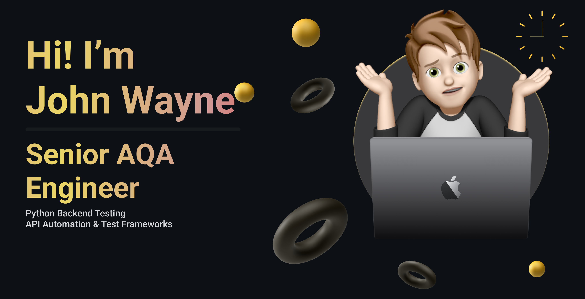

<!-- ============================= -->
<!--          BANNER SECTION       -->
<!-- ============================= -->

---

## 🧠 About Me  

I am an **AQA Engineer** with **2 years of commercial experience** in Python-based test automation.

- Automating **API and UI tests**
- Working with the Python ecosystem and testing frameworks
- Focused on test stability, readability, and long-term maintainability
- Interested in **AI tools, RAG systems, and engineering solutions**
- Building pet projects in my free time to better understand technologies

---

## ⚙️ Technologies & Tools  

<h3 align="center">🧩 Core stack (daily use)</h3>

  
  
  
  
  
  
  
  

<h3 align="center">🛠 Used in projects / familiar with</h3>

  
  
  
  
  

---

## 🚀 Projects  

### 🔹 [Casely-Kit](https://github.com/JohnWayneeee/Casely-Kit-)  
🤖 **AI-powered test case generator for QA engineers**

A tool that uses **LLMs** to automatically generate test cases based on:
- structured functional requirements
- existing test case examples

📌 What the project does:
- Generates new test cases from requirements
- Uses existing examples as a quality reference
- Reduces routine QA work
- Suitable for **manual QA and test case preparation for automation**

📂 Project structure:
- `feature-requirements/` — functional requirements  
- `test-case-examples/` — example test cases  
- `generated-test-cases/` — generated results  

---

### 🔹 [RAG Indexing Tool](https://github.com/JohnWayneeee/rag_indexing_tool)  
📚 **Universal data preparation tool for RAG systems**

A utility for indexing documents into a vector database for semantic search.

📌 Key features:
- Support for multiple document formats
- Data transformation into embeddings
- Integration into LLM pipelines
- Practical exploration of **RAG and AI architectures**

---

## 🌐 Contacts  

- 💬 [Telegram](https://t.me/GhostTraffic)
*Suggested greeting message:*
  "Hi! I'm [Your name], I'm [who you are: developer/recruiter/student etc.]. I want to discuss [purpose: project/collaboration/code question/other]."
- 💼 [LinkedIn](https://www.linkedin.com/in/john-wayne-b4a166391/)

---
