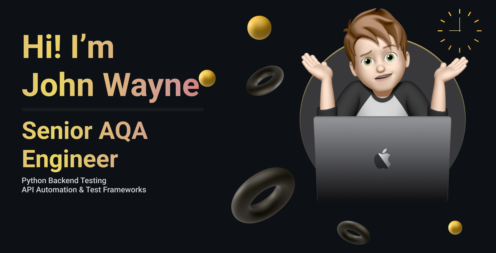

<!-- ============================= -->
<!--          BANNER SECTION       -->
<!-- ============================= -->

---

## Senior AQA Engineer with **4+ years** in **backend test automation**.

**Daily work:**

- **REST/SOAP/gRPC API** automation → Pytest + Requests
- **CI/CD pipelines** → blocking jobs, pytest-xdist (2-3x faster runs)
- **Pydantic validation** → strict API response typing
- **PostgreSQL/Redis** → end-to-end data validation
- **Allure reports** → team-friendly test results

**Key achievements:**

- 🚀 Accelerated test runs with parallel execution
- 🛡️ Blocking CI jobs → zero broken builds
- 📈 Retries implementation → +30% test stability
- 📋 Standardized test case templates for automation

---

## ⚙️ Tech Stack

<h3 align="center">🧩 Core stack (daily use)</h3>

  
  
  
  
  
  
  
  
  

<h3 align="center">🧪 Testing Workflow</h3>

  
  
  
  
  
  

---

## 🌐 Contacts

- 💬 [Telegram](https://t.me/GhostTraffic)  
  *"Hi! Interested in [job/collaboration/project]. Let's talk!"*
- 💼 [LinkedIn](https://www.linkedin.com/in/john-wayne-b4a166391/)

---
